# Prompting & RAG Foundations on watsonx.ai

[](https://www.python.org/)

> **Project status:** Complete, evaluated, live-tested, and validated locally through the complete offline test and validation suite.

This repository is a CLI-first Retrieval-Augmented Generation project built with IBM watsonx.ai and FAISS. It answers questions from a controlled synthetic policy corpus, returns local document and section citations, refuses unsupported questions, and rewrites grounded answers into three tones.

The detailed evidence base is intentionally kept in `docs/` and `data/evaluation/`. This README gives the shortest practical path for a supervisor to understand, install, run, and validate the completed project.

---

## Overview

The project implements the required Tier-1 RAG workflow:

- ingest and validate a Markdown document corpus;
- chunk policy sections with a fixed token-aware configuration;
- embed documents and user questions with watsonx.ai;
- store and search vectors with FAISS;
- retrieve Top-5 evidence chunks;
- generate answers from retrieved context only;
- resolve citations locally to document and section metadata;
- return a canonical refusal when the documents do not support an answer;
- transform grounded answers into formal, casual, and executive tones;
- validate model output as structured JSON and handle malformed output with a bounded repair path.

The corpus is synthetic. It was created for benchmark control and does not represent real employment, travel, legal, or security guidance.

---

## Key Capabilities

- Manifest-backed document loading and checksum validation.
- Section-aware chunking with deterministic chunk IDs.
- Watsonx document and query embeddings.
- Persistent FAISS `IndexFlatIP` vector storage.
- Cosine similarity over normalized vectors.
- Frozen Top-5 retrieval.
- Candidate A grounded prompt.
- Three tone prompt families:
  - `formal_report_summary`;
  - `casual_message`;
  - `concise_executive_briefing`.
- At least one few-shot example per tone; the final prompt set contains three per tone.
- Pydantic validation for grounded and tone outputs.
- Safe CLI error handling and project logs on `stderr`.
- Valid JSON on `stdout` when `--json` is requested.
- Offline validators for corpus, references, selected artifacts, final evidence, and project completeness.

---

## Architecture

```mermaid
flowchart LR
    D["Synthetic Markdown Policies"] --> M["Manifest Validation"]
    M --> C["Section-Aware Chunking"]
    C --> E["watsonx.ai Document Embeddings"]
    E --> F["FAISS IndexFlatIP"]

    Q["User Question"] --> QE["watsonx.ai Query Embedding"]
    QE --> R["Top-5 Retrieval"]
    F --> R
    R --> P["Candidate A Grounded Prompt"]
    P --> G["watsonx.ai Grounded Generation"]
    G --> V["JSON + Pydantic Validation"]
    V --> X["Local Citation Resolution"]
    X --> A["Grounded Answer or Refusal"]
    A --> T{"Tone requested?"}
    T -->|No| O["CLI Text or JSON"]
    T -->|Yes| TP["Tone Prompt + Few-Shots"]
    TP --> TG["Tone Generation"]
    TG --> TV["Tone JSON Validation"]
    TV --> O
```



For detailed architecture, see [`docs/ARCHITECTURE.md`](docs/ARCHITECTURE.md).

---

## Final Configuration

| Area | Final value |
| --- | --- |
| Corpus | Asteron Policies Corpus v2.1 |
| Documents | 5 |
| Sections | 60 |
| Registered facts | 89 |
| Selected chunks/vectors | 70 |
| Chunk size | 220 tokens |
| Chunk overlap | 40 tokens |
| Retrieval depth | Top-5 |
| Vector store | FAISS `IndexFlatIP` |
| Similarity | Cosine similarity over normalized vectors |
| Selected index path | `data/indexes/selected/` |
| Selected index ID | `selected-chunk-220-overlap-40` |
| Embedding model | `ibm/granite-embedding-278m-multilingual` |
| Embedding dimension | 768 |
| Primary generation model | `ibm/granite-4-h-small` |
| Comparison generation model | `mistralai/mistral-small-3-1-24b-instruct-2503` |
| Temperature | `0.0` |
| Top-p | `1.0` |

`sentence-transformers/all-MiniLM-L6-v2` is used only as a tokenizer asset for chunk-size measurement. Document and query embeddings are generated by `ibm/granite-embedding-278m-multilingual`.

The selected index, prompts, final outputs, metrics, owner-adjudication artifact, and frozen manifests are retained as evidence and are not regenerated during ordinary validation.

---

## Corpus

The project uses five fictional Asteron policy documents under `data/documents_v2_1/`. The corpus intentionally contains overlapping policy language, multi-source questions, unsupported concepts, numeric thresholds, dates, authorities, prohibitions, and retrieval distractors.

| Document | Subject |
| --- | --- |
| `code_conduct_conflicts_reporting_policy.md` | Conduct, conflicts, reporting, investigations, and records |
| `employee_leave_attendance_policy.md` | Leave, attendance, approvals, and return-to-work rules |
| `flexible_work_workplace_access_policy.md` | Flexible work, workplace access, visitors, and equipment |
| `information_security_access_control_policy.md` | Access control, accounts, remote access, and incidents |
| `travel_expense_corporate_card_policy.md` | Travel booking, expenses, receipts, reimbursement, and cards |

For corpus design and limitations, see [`docs/DATASET_CARD.md`](docs/DATASET_CARD.md).

---

## Repository Structure

```text
data/
  documents_v2_1/          synthetic source corpus
  indexes/selected/        selected FAISS binary, metadata, and config
  manifests/frozen/        frozen runtime, index, and prompt manifests
  evaluation/              experiment, final-output, scoring, and owner-review evidence
docs/                      detailed project documentation and reports
prompts/v2/
  grounded/                selected grounded prompt assets
  tones/                   three tone prompt pairs
  few_shot/                few-shot examples per tone
  schemas/                 structured-output schemas
scripts/                   build, dry-run, scoring, and validation entry points
src/rag_foundations/       runtime package
tests/                     offline unit, integration, CLI, and artifact tests
```

For a full evidence index, see [`docs/EVIDENCE_INDEX.md`](docs/EVIDENCE_INDEX.md).

---

## Technology Stack

- Python 3.11
- IBM `ibm-watsonx-ai`
- FAISS CPU
- NumPy
- Pydantic and Pydantic Settings
- Hugging Face Hub and `tokenizers` for tokenizer asset loading
- Pytest
- Ruff

The project does not use LangChain or LlamaIndex; the RAG pipeline is implemented directly in Python modules for reviewability.

---

## Requirements and Installation

The supported execution model is an editable installation from the repository checkout because prompt, corpus, manifest, evaluation, and index assets are loaded from repository-relative paths.

Use Python 3.11.

```powershell
git clone https://github.com/Adnanwadee/rag-foundations-watsonx.git
cd rag-foundations-watsonx

python -m venv .venv
.\.venv\Scripts\Activate.ps1

python -m pip install --upgrade pip
python -m pip install -e ".[dev]"
python -m pip check
```

On macOS or Linux:

```bash
python3.11 -m venv .venv
source .venv/bin/activate
python -m pip install --upgrade pip
python -m pip install -e ".[dev]"
python -m pip check
```

Do not commit `.env`. It is intentionally local and ignored.

---

## Watsonx Configuration

Live CLI execution requires Watsonx credentials in environment variables or a local root `.env` file. Set these names locally:

```text
WATSONX_URL
WATSONX_PROJECT_ID
WATSONX_API_KEY
```

Optional:

```text
LOG_LEVEL=INFO
```

The public frozen runtime does not let environment variables silently change the evaluated model IDs, Top-K value, chunk size, chunk overlap, prompts, temperature, top-p, or selected index.

---

## Running the CLI

Show help:

```powershell
python -m rag_foundations.cli --help
python -m rag_foundations.cli ask --help
```

Ask a grounded question:

```powershell
python -m rag_foundations.cli ask "How many remote days may an eligible employee request per week?"
```

Return JSON:

```powershell
python -m rag_foundations.cli ask --json "How many remote days may an eligible employee request per week?"
```

Request one tone:

```powershell
python -m rag_foundations.cli ask --tone formal_report_summary --json "How many remote days may an eligible employee request per week?"
python -m rag_foundations.cli ask --tone casual_message --json "How many remote days may an eligible employee request per week?"
python -m rag_foundations.cli ask --tone concise_executive_briefing --json "How many remote days may an eligible employee request per week?"
```

Request all tones:

```powershell
python -m rag_foundations.cli ask --all-tones --json "How many remote days may an eligible employee request per week?"
```

---

## Output and Unsupported Questions

A grounded JSON response includes:

```json
{
  "question": "How many remote days may an eligible employee request per week?",
  "grounded_result": {
    "answer": "Eligible employees may work remotely up to 2 working days per week.",
    "is_answerable": true,
    "citations": [
      {
        "document_id": "policy-flexible-work-v2-1",
        "title": "Flexible Work and Workplace Access Policy",
        "section_heading": "3. Eligibility and Remote-Work Limits",
        "source_path": "data/documents_v2_1/flexible_work_workplace_access_policy.md"
      }
    ]
  }
}
```

For unsupported questions, the canonical response is:

```text
I don't know based on the provided documents.
```

Unsupported results use `is_answerable: false` and no citations.

Citation metadata is resolved locally against retrieved chunks. The `supporting_quote` field contains retrieved supporting evidence text and is not guaranteed to be a minimal sentence-level quotation.

Tone output is schema-validated, while semantic preservation is evaluated empirically and is not enforced by a complete deterministic fact-equivalence checker.

---

## Offline Validation

These checks do not require Watsonx credentials and do not make live model calls:

```powershell
python -m pip check
python -m compileall -q src scripts tests
python -m ruff check .
python -m pytest -q

python scripts/validate_references.py
python scripts/validate_corpus_v2_1.py
python scripts/validate_final_v2.py
python scripts/validate_project_complete.py

python scripts/run_final_v2.py --dry-run
python scripts/build_watsonx_faiss_index.py --preflight-only

python -m rag_foundations.cli --help
python -m rag_foundations.cli ask --help
```

The Final-v2 dry run reports `external_calls: 0`.

The FAISS preflight validates the selected corpus and selected index and reports:

```text
External calls: 0
Files written: 0
```

**GitHub Actions note:** The repository includes an offline CI workflow definition. Remote workflow execution is currently unavailable because of GitHub account billing restrictions; the equivalent compile, lint, test, validator, dry-run, CLI-help, and FAISS-preflight checks were completed locally.

When GitHub Actions can run, the workflow is designed to avoid Watsonx credentials, a real `.env`, live model calls, and Hugging Face downloads.

---

## Final Evaluation Results

For methodology and denominators, see [`docs/EVALUATION_METHOD.md`](docs/EVALUATION_METHOD.md). For full results and failure analysis, see [`docs/FINAL_REPORT.md`](docs/FINAL_REPORT.md).

### Retrieval

| Metric | Result |
| --- | ---: |
| Hit@1 | 0.95 |
| Hit@3 | 1.00 |
| Hit@5 | 1.00 |
| MRR | 0.975 |
| All-expected-source coverage@5 | 0.90 |

### Grounded Generation

| Model | Grounded outputs | Strict grounded accuracy |
| --- | ---: | ---: |
| `ibm/granite-4-h-small` | 24 | 0.8333 |
| `mistralai/mistral-small-3-1-24b-instruct-2503` | 24 | 0.8333 |

The final grounded set contains 24 questions: 20 answerable and 4 unsupported.

### Tone Transformation

| Model | Tone inputs | Tone outputs | Fully valid triplet rate | Triplet distinct rate |
| --- | ---: | ---: | ---: | ---: |
| `ibm/granite-4-h-small` | 20 | 60 | 0.40 | 0.80 |
| `mistralai/mistral-small-3-1-24b-instruct-2503` | 20 | 60 | 0.45 | 1.00 |

The tone task evaluates 20 inputs across three target tones and two generation models, producing 120 saved tone outputs.

### Experiments

The repository retains four experiment families:

- retrieval and chunking comparison;
- grounded prompt comparison;
- tone prompt comparison;
- generation-model comparison.

For experiment details, see [`docs/EXPERIMENTS.md`](docs/EXPERIMENTS.md). The comparison model is described only by its nominal documented parameter count and saved task behavior.

---

## Evidence And Traceability

The final submission is intentionally evidence-first. Each headline result in this README is backed by a committed artifact or documentation page, and the retained evidence separates design-time experiments from the frozen Final-v2 evaluation.

### Core Build Artifacts

| Item | Repository evidence |
| --- | --- |
| Synthetic corpus | `data/documents_v2_1/` |
| Corpus manifest | `data/manifest_v2_1.json` |
| Fact registry | `data/corpus_fact_registry_v2_1.json` |
| Selected FAISS index | `data/indexes/selected/` |
| Frozen final manifests | `data/manifests/frozen/` |
| Prompt templates | `prompts/v2/` |
| Runtime package | `src/rag_foundations/` |
| Automated tests | `tests/` |
| Offline CI workflow definition | `.github/workflows/ci.yml` |

### Evaluation Artifacts

| Evaluation area | Repository evidence |
| --- | --- |
| Final grounded outputs | `data/evaluation/final_v2/grounded_results.jsonl` |
| Final tone outputs | `data/evaluation/final_v2/tone_results.jsonl` |
| Final aggregate metrics | `data/evaluation/final_v2/scoring/final_metrics.json` |
| Frozen grounded prompt set | `data/evaluation/final_v2/final_questions_v2.json` |
| Frozen tone input set | `data/evaluation/final_v2/final_tone_inputs_v2.json` |
| Chunking experiment | `data/evaluation/experiments/retrieval_chunking_comparison.json` |
| Grounded prompt experiment | `data/evaluation/experiments/grounded_prompt_comparison.json` |
| Tone prompt experiment | `data/evaluation/experiments/tone_prompt_comparison.json` |
| Generation-model comparison | `data/evaluation/experiments/model_comparison.json` |
| Live smoke-test notes | `docs/LIVE_SMOKE_TEST.md` |

### Protected Final Configuration

The selected Final-v2 setup is frozen to make evaluation reproducible:

- corpus: `data/documents_v2_1/`;
- index: `data/indexes/selected/`;
- chunk size: 220 tokens;
- chunk overlap: 40 tokens;
- retrieval depth: Top-5;
- vector index: FAISS `IndexFlatIP`;
- similarity interpretation: cosine similarity over normalized vectors;
- embedding dimension: 768;
- grounded answer model: `ibm/granite-4-h-small`;
- comparison answer model: `mistralai/mistral-small-3-1-24b-instruct-2503`.

The final validators are designed to catch accidental drift in these committed artifacts. A dry run checks orchestration without external calls, and the FAISS preflight checks that the selected corpus and selected index are present without rebuilding or rewriting them.

### Corpus Benchmark Scope

The corpus is synthetic by design. It is useful for a controlled RAG benchmark because every document, section, and fact can be inspected directly, and the evaluation questions can be matched against a known fact registry. It should not be treated as legal, HR, financial, security, or travel-policy guidance for a real organization.

The synthetic setup also creates limitations:

- policy language is cleaner than many real internal documents;
- section boundaries are intentionally stable;
- expected answers are narrow enough for deterministic review;
- all evidence comes from a small private-policy domain;
- user behavior, ambiguity, and document churn are underrepresented.

These limits are documented because the benchmark measures implementation correctness and evidence discipline, not broad domain readiness.

---

## Known Limitations

- The corpus is synthetic and benchmark-oriented, not a real operating policy set.
- Unsupported-question behavior is strong but not perfect in saved evaluation; one primary-model unsupported case substituted a related travel rule.
- Tone semantic preservation is empirical and non-perfect, especially for casual and concise executive styles.
- Some multi-source grounded answers are partially correct but incomplete.
- Citation metadata is locally resolved, but retrieved supporting text is not minimized to sentence-level quotations.
- `request_timeout_seconds` is retained as configuration metadata rather than a guaranteed transport timeout across every IBM SDK path.
- Runtime assets are repository-relative; standalone wheel packaging of all assets is not the supported execution model.
- Live Watsonx behavior can vary with service availability, credentials, and account permissions.

---

## Documentation Map

| Document | Purpose |
| --- | --- |
| [`docs/PROJECT_REQUIREMENTS.md`](docs/PROJECT_REQUIREMENTS.md) | Original assignment brief |
| [`docs/PROJECT_PLAN.md`](docs/PROJECT_PLAN.md) | Milestones, scope, evidence mapping, and status |
| [`docs/ARCHITECTURE.md`](docs/ARCHITECTURE.md) | Detailed runtime, retrieval, validation, and CI architecture |
| [`docs/DESIGN_DECISIONS.md`](docs/DESIGN_DECISIONS.md) | Implementation choices and rationale |
| [`docs/PROMPT_DESIGN.md`](docs/PROMPT_DESIGN.md) | Grounded and tone prompt design |
| [`docs/EXPERIMENTS.md`](docs/EXPERIMENTS.md) | Experiment design and retained results |
| [`docs/EVALUATION_METHOD.md`](docs/EVALUATION_METHOD.md) | Evaluation rubric, denominators, and review layers |
| [`docs/FINAL_REPORT.md`](docs/FINAL_REPORT.md) | Final results, interpretation, and failure analysis |
| [`docs/DATASET_CARD.md`](docs/DATASET_CARD.md) | Synthetic corpus design and limitations |
| [`docs/EVIDENCE_INDEX.md`](docs/EVIDENCE_INDEX.md) | Artifact and evidence path index |
| [`docs/LIVE_SMOKE_TEST.md`](docs/LIVE_SMOKE_TEST.md) | Recorded local live smoke-test evidence |

---

## Author

Adnan Wadee Abdullah

Tier-1 Prompting and RAG Foundations project using IBM watsonx.ai, FAISS, structured prompting, grounded citations, controlled tone transformation, and offline validation.
