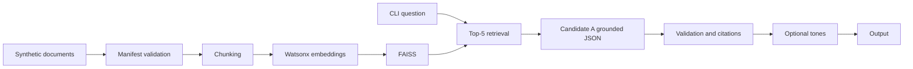

# RAG Foundations

[](.github/workflows/ci.yml) Python 3.11

RAG Foundations is a CLI-first retrieval-augmented generation project over a controlled local policy corpus. It loads synthetic Markdown policies, retrieves section-aware chunks from a frozen FAISS index, generates grounded JSON answers with local document and section citations, refuses unsupported questions when evidence is absent, and can rewrite answer text into formal, casual, or concise executive tones.

The dataset is synthetic. The five Asteron policy files are fictional benchmark documents, not real company policies; see `docs/DATASET_CARD.md`.

## Key Capabilities

- ingestion and deterministic section-aware chunking;
- Watsonx embeddings and FAISS `IndexFlatIP` retrieval;
- grounded answers with document and section citations;
- canonical unsupported refusal;
- three tones with structured JSON and few-shot examples;
- bounded repair for malformed JSON;
- CLI and offline validation.

## Architecture



## Repository Map

| Path | Purpose |
| --- | --- |
| `src/rag_foundations/` | Runtime package, CLI, retrieval, generation, tone transformation, schemas, and validators. |
| `data/documents_v2_1/` | Five byte-frozen synthetic Asteron policy documents. |
| `data/indexes/selected/` | Selected FAISS binary, metadata, and config. |
| `data/manifests/frozen/` | Frozen runtime, prompt, and index manifests. |
| `prompts/v2/` | Selected prompts, few-shots, and schemas. |
| `data/evaluation/final_v2/` | Final datasets, retrieval evidence, saved outputs, owner adjudication, metrics, and manifests. |
| `data/evaluation/experiments/` | Compact experiment summaries. |
| `docs/` | Supervisor-facing documentation. |
| `scripts/` | Build, scoring, dry-run, and validation scripts. |

## Installation

```powershell
python -m venv .venv
.\.venv\Scripts\Activate.ps1
python -m pip install --upgrade pip
python -m pip install -e ".[dev]"
Copy-Item .env.example .env
```

Required live variables are `WATSONX_URL`, `WATSONX_PROJECT_ID`, `WATSONX_API_KEY`, and optional `LOG_LEVEL`. `.env` is local, ignored by Git, and intentionally not created in this pass.

## CLI Examples

```powershell
python -m rag_foundations.cli --help
python -m rag_foundations.cli ask --help
python -m rag_foundations.cli ask "What receipt threshold applies to expense documentation?"
python -m rag_foundations.cli ask "What receipt threshold applies to expense documentation?" --tone formal_report_summary
python -m rag_foundations.cli ask "What receipt threshold applies to expense documentation?" --tone casual_message
python -m rag_foundations.cli ask "What receipt threshold applies to expense documentation?" --tone concise_executive_briefing
python -m rag_foundations.cli ask "What receipt threshold applies to expense documentation?" --all-tones
python -m rag_foundations.cli ask "What receipt threshold applies to expense documentation?" --json
python -m rag_foundations.cli ask "Which office dress-code color is mandatory on client meeting days?"
```

Representative output:

```json
{"answerable": true, "answer": "An itemized receipt is required for every expense of KWD 3 or more.", "citations": [{"chunk_id": "chunk-example", "document": "Travel, Expense, and Corporate Card Policy", "section": "Documentation and Receipt Standards"}]}
```

## External-Call Behavior

Offline validators, tests, CLI help, and Final v2 dry-run make zero external calls. A live grounded CLI question performs one query embedding call and one generation call. Each requested tone adds one generation call, plus at most one repair call when malformed JSON is returned.

## Frozen Final Configuration

| Setting | Value |
| --- | --- |
| Corpus | Asteron Policies Corpus v2.1 |
| Chunking | 220 tokens, 40 overlap |
| Retrieval | Top-5, FAISS `IndexFlatIP` |
| Embedding model | `ibm/granite-embedding-278m-multilingual` |
| Primary model | `ibm/granite-4-h-small` |
| Comparison model | `mistralai/mistral-small-3-1-24b-instruct-2503` |
| Parameters | temperature `0.0`, top_p `1.0` |
| Grounded prompt | Candidate A |
| Tone prompts | baseline v2 |
| Runtime index | `data/indexes/selected/` |

## Final v2 Metrics

| Area | IBM Granite 4 Small | Mistral Small 3.1 24B |
| --- | ---: | ---: |
| Grounded answerable correct | 17/20 | 16/20 |
| Unsupported refusals correct | 3/4 | 4/4 |
| Strict grounded accuracy | 0.8333 | 0.8333 |
| Fully valid tone triplets | 8/20 | 9/20 |
| Distinct tone triplets | 16/20 | 20/20 |

Retrieval metrics: Hit@1 `0.95`, Hit@3 `1.0`, Hit@5 `1.0`, MRR `0.975`, expected-source coverage@5 `0.9`.

## Metric Definitions

Hit@k measures whether an expected source appears by rank k. MRR is mean reciprocal rank. Expected-source coverage@5 measures all expected sources in Top-5. Answerable correctness counts correct answers among 20 answerable questions. Unsupported correctness counts correct refusals among 4 unsupported questions. Strict grounded accuracy counts correct answerable and unsupported outputs over 24 questions. Fully valid tone triplet requires all three tones to pass. Distinct tone triplet means the three rewrites are recognizably different.

## Acceptance Matrix

| Criterion | Status | Evidence |
| --- | --- | --- |
| >=70% grounded correctness | PASS | Granite achieved 17/20 answerable correct and strict grounded accuracy 0.8333. |
| Document + section citation | PASS | Citations resolve to saved chunk metadata with document and section. |
| Clear unsupported refusal | PARTIAL | Granite refused 3/4 unsupported questions; Mistral refused 4/4. |
| Three distinct recognizable tones | PARTIAL | Granite produced 16/20 distinct triplets; Mistral produced 20/20. |
| Structured tone output + few-shot | PASS | Tone JSON schema and three few-shot files per tone are retained. |
| Malformed-output handling | PASS | Grounded and tone paths allow one bounded repair retry. |
| >=3 documented experiments | PASS | Four compact experiment summaries are retained. |
| Evaluation report with retrieval, >=3 failures, 20 tone inputs, and model comparison | PASS | Final Report includes all required evaluation sections. |

## Strengths

Strong retrieval quality, local citation resolution, strict schemas, saved evidence, owner-verified scoring, fair model comparison, and offline validators.

## Known Limitations

Granite missed one unsupported refusal, some multi-source answers were partial, tone reliability was partial, corpus prose is benchmark-oriented, live service behavior may vary, and latency is not benchmarked.

## Validation Commands

```powershell
python -m compileall src scripts
python -m ruff check src scripts tests
python -m pytest -q
python scripts/validate_documentation.py
python scripts/validate_references.py
python scripts/validate_corpus_v2_1.py
python scripts/validate_final_v2.py
python scripts/validate_project_complete.py
python -m pip check
python -m rag_foundations.cli --help
python -m rag_foundations.cli ask --help
python scripts/run_final_v2.py --dry-run
```

## Documentation Map

`docs/PROJECT_REQUIREMENTS.md`, `docs/DATASET_CARD.md`, `docs/PROJECT_PLAN.md`, `docs/DESIGN_DECISIONS.md`, `docs/ARCHITECTURE.md`, `docs/PROMPT_DESIGN.md`, `docs/EXPERIMENTS.md`, `docs/EVALUATION_METHOD.md`, `docs/FINAL_REPORT.md`, and `docs/EVIDENCE_INDEX.md`.

Reported metrics refer to the saved evaluated run. Live model behavior may vary.
