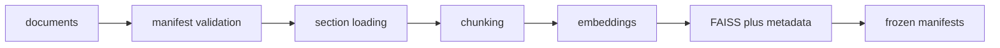
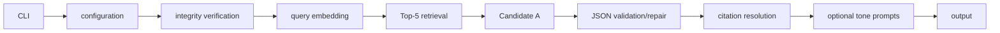

# Architecture

The active runtime reads `data/indexes/selected/` and `data/manifests/frozen/`. The dataset is synthetic; see `docs/DATASET_CARD.md`.

## Offline Ingestion And Indexing

`scripts/build_watsonx_faiss_index.py` rebuilds to `artifacts/rebuilt-index/` by default. It validates 5 documents, 60 sections, 70 chunks, 768 dimensions, 70 vectors, and the embedding model, and it cannot overwrite the selected index without explicit overwrite.

## Query-Time Runtime

## Component Responsibilities

`config.py` reads local settings. `faiss_store.py` loads and searches FAISS. `frozen_v2_runtime.py` verifies hashes and wires live clients. `grounded_generation.py`, `tone_transformation.py`, and `schemas.py` enforce output contracts.

## Credentials Boundary

Offline commands require no `.env`. Live CLI calls require local watsonx variables in ignored `.env`.

## Error Handling

Unsupported outputs normalize only when the model marks unanswerable with no citations. Malformed JSON gets one repair retry. Invalid citation IDs raise errors.

## Offline Versus Live Commands

Compile, Ruff, pytest, docs validation, reference validation, corpus validation, Final v2 validation, project-complete validation, CLI help, and dry-run are offline. A live grounded answer uses one embedding and one generation call; each tone adds one generation call and at most one repair call.

## Integrity Verification

Protected hashes cover corpus, prompts, selected index assets, and frozen manifests. The Final v2 artifact manifest covers retained evaluation evidence.
