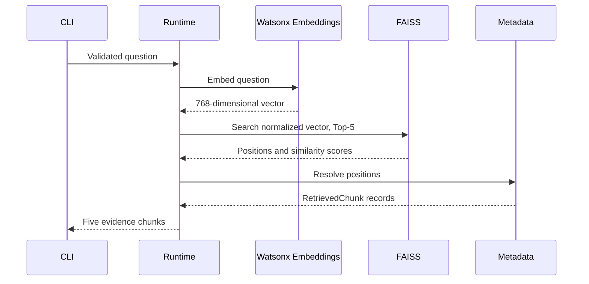
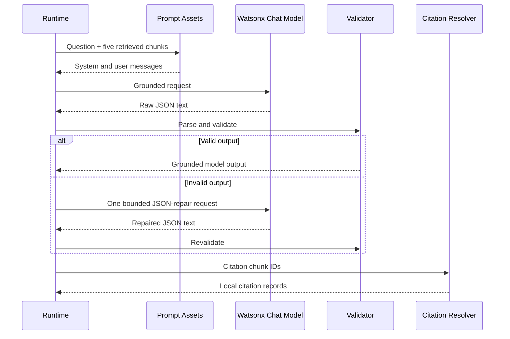
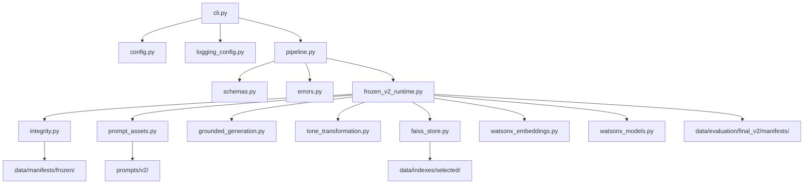

# System Architecture — Prompting & RAG Foundations

## Architecture Summary

| Item | Selected architecture |
| --- | --- |
| Application style | Modular Python application |
| Public interface | Command-line interface |
| RAG platform | IBM watsonx.ai |
| Vector store | Persistent FAISS `IndexFlatIP` |
| Retrieval method | Cosine similarity over normalized vectors |
| Retrieval depth | Top-5 |
| Corpus | Five synthetic Markdown policy documents |
| Grounded prompt | Candidate A |
| Tone prompts | Three independent baseline-v2 prompt templates |
| Output validation | JSON parsing, Pydantic validation, and bounded repair |
| Runtime configuration | Frozen Final-v2 configuration |
| Primary runtime mode | Editable installation from repository checkout |
| Offline validation | Pytest, validators, dry-run, preflight, and archive isolation |

---

## 1. Purpose

This document describes the final technical architecture of the Prompting and RAG Foundations project.

It explains:

- how documents are ingested and converted into vector-search assets;
- how a user question moves through retrieval and generation;
- how citations are resolved;
- how tone transformations are performed;
- how unsupported questions and malformed outputs are handled;
- which components make external calls;
- how the frozen runtime differs from generic development components;
- how configuration, logging, security, integrity, and validation are separated.

The project intentionally uses direct Python modules rather than LangChain, LlamaIndex, or another orchestration framework. This makes the main RAG operations and validation boundaries explicit and reviewable.

---

## 2. High-Level Architecture

```mermaid
flowchart LR
    subgraph Offline_Indexing["Offline Preparation and Index Construction"]
        D1["Synthetic Markdown Documents"]
        D2["Manifest Validation"]
        D3["Section-Aware Loading"]
        D4["Token-Aware Chunking"]
        D5["watsonx.ai Document Embeddings"]
        D6["Normalized Vectors"]
        D7["FAISS Index + Metadata + Config"]

        D1 --> D2
        D2 --> D3
        D3 --> D4
        D4 --> D5
        D5 --> D6
        D6 --> D7
    end

    subgraph Live_Query["Live Query Runtime"]
        Q1["CLI Question"]
        Q2["Question Validation"]
        Q3["Frozen Asset Verification"]
        Q4["watsonx.ai Query Embedding"]
        Q5["FAISS Top-5 Retrieval"]
        Q6["Candidate A Grounded Prompt"]
        Q7["watsonx.ai Grounded Generation"]
        Q8["JSON and Pydantic Validation"]
        Q9["Citation Resolution"]
        Q10["Grounded Answer"]
        Q11{"Tone Requested?"}
        Q12["Tone Prompt + Few-Shot Examples"]
        Q13["watsonx.ai Tone Generation"]
        Q14["Tone JSON Validation"]
        Q15["CLI Text or JSON Output"]

        Q1 --> Q2
        Q2 --> Q3
        Q3 --> Q4
        Q4 --> Q5
        Q5 --> Q6
        Q6 --> Q7
        Q7 --> Q8
        Q8 --> Q9
        Q9 --> Q10
        Q10 --> Q11
        Q11 -->|No| Q15
        Q11 -->|Yes| Q12
        Q12 --> Q13
        Q13 --> Q14
        Q14 --> Q15
    end

    D7 --> Q5
```



---

## 3. Architectural Boundaries

The project is divided into five main boundaries.

| Boundary | Responsibility |
| --- | --- |
| Source and ingestion | Load, validate, section, and chunk documents |
| Retrieval | Embed questions and search the selected FAISS index |
| Generation | Produce grounded and tone-transformed outputs |
| Application orchestration | Coordinate retrieval, generation, tones, metadata, and CLI |
| Evidence and validation | Preserve configuration, outputs, metrics, hashes, and offline checks |

These boundaries keep model-service operations separate from:

- local document processing;
- local vector search;
- output validation;
- citation construction;
- reporting and evaluation.

---

## 4. Repository Asset Architecture

```text
Repository root
├── data/
│   ├── documents_v2_1/          # Frozen synthetic source documents
│   ├── indexes/selected/        # Selected FAISS index and metadata
│   ├── manifests/frozen/        # Frozen runtime, index, and prompt manifests
│   └── evaluation/              # Development and final evidence
├── prompts/v2/
│   ├── grounded/                # Candidate A system and user prompts
│   ├── tones/                   # Three tone prompt pairs
│   ├── few_shot/                # Three examples per tone
│   └── schemas/                 # Structured-output schemas
├── src/rag_foundations/         # Runtime and evaluation implementation
├── scripts/                     # Build, preflight, scoring, and validators
└── tests/                       # Offline regression and integration tests
```

### Asset categories

| Asset category | Mutability during ordinary execution |
| --- | --- |
| Source documents | Read-only |
| Selected FAISS index | Read-only |
| Frozen manifests | Read-only |
| Selected prompts | Read-only |
| Final evaluation outputs | Read-only |
| CLI result | Created in memory and printed |
| Rebuilt index under `artifacts/` | Optional write operation |
| Local `.env` | Local-only, ignored by Git |

The public CLI does not rewrite the selected index, prompts, source documents, or final evaluation evidence.

---

## 5. Document Ingestion Architecture

## 5.1 Input documents

The source corpus is stored under:

```text
data/documents_v2_1/
```

The five documents are loaded through:

```text
data/manifest_v2_1.json
```

The loader does not rely on arbitrary directory scanning as the authoritative source of document identity.

## 5.2 Manifest-backed validation

The document-loading layer verifies information such as:

- corpus version;
- document ID;
- document title;
- source path;
- expected section titles;
- expected section count;
- source checksum;
- synthetic-content declaration.

This makes ingestion deterministic and protects against silently loading:

- an unexpected file;
- a renamed document;
- a modified source;
- a document from another corpus version.

## 5.3 Section-aware loading

Markdown second-level headings define policy sections.

The loader produces structured document and section objects while preserving:

- document ID;
- document title;
- section heading;
- source path;
- corpus version;
- section order;
- section text.

The section heading later becomes part of the citation returned to the user.

## 5.4 Main modules

| Module | Responsibility |
| --- | --- |
| `corpus_v2_1.py` | Corpus constants, expected structure, and corpus-specific validation support |
| `document_loader.py` | Manifest-backed document loading and section extraction |
| `schemas.py` | Typed document, section, chunk, citation, and response contracts |

---

## 6. Chunking Architecture

## 6.1 Selected strategy

The final chunking configuration is:

```text
Chunk size:     220 tokens
Chunk overlap:  40 tokens
```

The chunker preserves section boundaries and adds overlap only where a section requires more than one chunk.

## 6.2 Chunk provenance

Every selected chunk retains metadata including:

- chunk ID;
- document ID;
- document title;
- section heading;
- source path;
- token count;
- embedding model ID;
- embedding dimension;
- corpus version;
- index ID;
- FAISS position;
- chunk text.

This metadata is stored separately from the FAISS binary.

## 6.3 Why metadata is separated from vectors

FAISS stores and searches numeric vectors. It does not provide the complete document-provenance model required by the application.

The project therefore persists three related artifacts:

```text
asteron_policies_watsonx.index
metadata.json
index_config.json
```

The vector position returned by FAISS is used to select the corresponding local metadata record.

## 6.4 Chunking module

```text
src/rag_foundations/chunking.py
```

The chunking implementation supports:

- tokenizer-aware length calculation;
- section-preserving chunks;
- overlap;
- deterministic chunk IDs;
- validation of chunk size and overlap;
- reproducible chunk order.

---

## 7. Embedding Architecture

## 7.1 Selected model

The selected embedding model is:

```text
ibm/granite-embedding-278m-multilingual
```

The expected embedding dimension is:

```text
768
```

## 7.2 Document embeddings

During a real index build:

1. source documents are validated;
2. sections are loaded;
3. sections are chunked;
4. chunk text is sent to the Watsonx embedding service;
5. returned vectors are validated;
6. vectors are converted to contiguous `float32`;
7. vectors are L2-normalized;
8. vectors are added to FAISS;
9. metadata and index configuration are written beside the binary index.

## 7.3 Query embeddings

During a live question:

1. the question is validated;
2. the question is sent to the same selected embedding model;
3. the returned query vector is checked against the expected dimension;
4. the query vector is normalized;
5. FAISS performs an inner-product search.

Because both document and query vectors are normalized, inner product is used as cosine similarity.

## 7.4 Main module

```text
src/rag_foundations/watsonx_embeddings.py
```

Its main responsibility is to provide a validated Watsonx embedding adapter for:

- document batches;
- individual queries;
- expected model identity;
- expected output shape;
- safe SDK error handling.

---

## 8. FAISS Retrieval Architecture

## 8.1 Selected vector store

The project uses:

```text
FAISS IndexFlatIP
```

The selected persisted index is stored under:

```text
data/indexes/selected/
```

## 8.2 Selected index contents

```text
Selected vectors:           70
Selected metadata records:  70
Embedding dimension:        768
Chunking configuration:     220 / 40
Retrieval depth:            Top-5
```

## 8.3 Retrieval sequence



## 8.4 Retrieval validation

The FAISS layer validates:

- non-empty question text;
- query-vector shape;
- embedding dimension;
- numeric data type;
- vector and metadata counts;
- unique chunk IDs;
- valid FAISS positions;
- embedding-model consistency;
- index-configuration consistency;
- valid Top-K value.

## 8.5 Main module

```text
src/rag_foundations/faiss_store.py
```

It is responsible for:

- building FAISS indexes;
- persisting index assets;
- loading persisted stores;
- validating configuration and metadata;
- normalizing vectors;
- searching the selected store;
- returning typed retrieved chunks.

---

## 9. Frozen Runtime Architecture

The public CLI uses the **frozen Final-v2 runtime**.

```text
src/rag_foundations/frozen_v2_runtime.py
```

This module is the integration boundary between:

- frozen repository assets;
- Watsonx clients;
- selected FAISS retrieval;
- Candidate A grounded generation;
- selected tone prompts;
- application-level pipeline orchestration.

## 9.1 Frozen values

The public runtime requires:

| Setting | Frozen value |
| --- | --- |
| Grounded candidate | Candidate A |
| Primary generation model | `ibm/granite-4-h-small` |
| Embedding model | `ibm/granite-embedding-278m-multilingual` |
| Retrieval depth | Top-5 |
| Selected retrieval configuration | `chunk-220-overlap-40` |
| Chunk size | 220 |
| Chunk overlap | 40 |
| Embedding dimension | 768 |
| Temperature | `0.0` |
| Top-p | `1.0` |
| Grounded maximum tokens | 500 |
| Tone maximum tokens | 350 |
| Maximum repair retries | 1 |

These values are not replaced by arbitrary CLI arguments.

## 9.2 Runtime component construction

The frozen component factory performs the following work:

1. verifies protected prompt, index, and manifest hashes;
2. loads the frozen runtime configuration;
3. verifies the selected prompt family;
4. verifies the selected index identity;
5. loads local settings;
6. creates the Watsonx API runtime;
7. loads the selected FAISS store;
8. validates the FAISS configuration;
9. creates the Watsonx embedding provider;
10. creates a reusable Watsonx chat client;
11. injects frozen retrieval and generation functions into the application pipeline.

## 9.3 Why the runtime is frozen

Freezing prevents the public evaluated path from silently changing:

- model IDs;
- Top-K;
- chunking;
- selected prompts;
- selected index;
- generation parameters;
- output contracts.

This keeps the live CLI aligned with the retained final evaluation evidence.

---

## 10. Generic and Frozen Execution Paths

The repository contains both reusable generic components and one frozen public path.

### Generic development path

The generic modules support:

- dependency injection;
- fake or mocked clients in tests;
- independent retrieval functions;
- reusable grounded generation;
- reusable tone transformation;
- development experiments.

Main modules include:

```text
grounded_generation.py
tone_transformation.py
pipeline.py
```

### Frozen public path

The public CLI calls:

```text
cli.py
    ↓
pipeline.py
    ↓
frozen_v2_runtime.py
```

The frozen runtime then injects the selected Final-v2 behavior into the generic pipeline interface.

### Architectural benefit

This design provides:

- one stable public runtime;
- reusable internal contracts;
- offline unit testing;
- no need to duplicate high-level orchestration;
- controlled separation between experimental flexibility and evaluated behavior.

### Important tone-validation distinction

The generic tone module contains broader content-preservation and surface-validation utilities.

The frozen Final-v2 tone path guarantees:

- valid JSON;
- a valid tone identifier;
- a non-empty structured tone output;
- local retention of grounded citations;
- at most one repair retry.

Strict semantic equivalence between the grounded answer and rewritten tone output is evaluated through the saved tone-evaluation process. It is not represented as a complete deterministic guarantee in the live frozen runtime.

---

## 11. Grounded Generation Architecture

## 11.1 Prompt construction

The selected grounded prompt assets are:

```text
prompts/v2/grounded/candidate_a.system.txt
prompts/v2/grounded/candidate_a.user.txt
```

The runtime combines:

- the system instruction;
- the user question;
- the five retrieved chunks;
- chunk IDs;
- document titles;
- section headings;
- structured-output requirements.

## 11.2 Model contract

The generated object must provide:

- an answerability decision;
- answer text;
- citation chunk IDs.

The model is not allowed to supply arbitrary final citation metadata.

## 11.3 Local citation resolution

After model output validation:

1. every returned citation chunk ID is checked;
2. each ID must belong to the current retrieved set;
3. duplicate or invalid IDs are rejected;
4. local metadata is copied from the retrieved chunk;
5. the final citation object is constructed by the application.

This means the application, not the model, is responsible for authoritative:

- document title;
- section heading;
- source path;
- retrieved supporting excerpt;
- corpus version;
- index ID.

## 11.4 Grounded sequence



---

## 12. Unsupported-Question Architecture

The canonical unsupported answer is:

```text
I don't know based on the provided documents.
```

## 12.1 Unsupported contract

An unsupported result must contain:

```json
{
  "is_answerable": false,
  "citations": []
}
```

The runtime normalizes a correctly declared unsupported result to the canonical refusal text.

## 12.2 Tone behavior for unsupported answers

When the grounded result is unsupported:

- no tone-generation model call is made;
- one requested tone receives the canonical refusal locally;
- `--all-tones` creates three local refusal variations;
- citations remain empty.

This avoids spending additional model calls to rewrite an unsupported answer.

## 12.3 Why retrieval still returns chunks

Vector search always returns the nearest available vectors when the index contains enough records.

The final answerability decision is therefore made by the grounded-generation layer using the retrieved evidence and question—not by the mere existence of Top-K search results.

---

## 13. Tone Transformation Architecture

## 13.1 Supported tones

| Tone ID | Prompt stem |
| --- | --- |
| `formal_report_summary` | `formal` |
| `casual_message` | `casual` |
| `concise_executive_briefing` | `executive` |

## 13.2 Assets per tone

Each tone uses:

```text
one system prompt
one user prompt
one few-shot JSON file
three few-shot examples
```

The selected assets are stored under:

```text
prompts/v2/tones/
prompts/v2/few_shot/
```

## 13.3 Tone request input

A tone request receives:

- the original question;
- the validated grounded answer;
- the selected tone instructions;
- the corresponding few-shot examples;
- the required tone JSON structure.

The tone model does not create new citations.

The application copies the already validated grounded citations into the final tone result.

## 13.4 One-tone sequence

```text
Grounded answer
    ↓
Selected tone prompt
    ↓
Few-shot examples
    ↓
Watsonx tone-generation call
    ↓
JSON parsing
    ↓
Tone-name validation
    ↓
Optional one-time repair
    ↓
Local citation retention
    ↓
ToneResult
```

## 13.5 All-tone sequence

For `--all-tones`, the tones are executed in this fixed order:

1. formal report summary;
2. casual message;
3. concise executive briefing.

The final application result contains one `AllToneResult` with three ordered variations.

---

## 14. Structured-Output Architecture

## 14.1 Validation layers

Generated content passes through multiple layers:

1. raw response extraction from the IBM SDK result;
2. whitespace normalization;
3. JSON parsing;
4. Pydantic model validation;
5. expected-field and enum validation;
6. citation-ID validation for grounded output;
7. application-level result construction.

## 14.2 Bounded repair

Each generated object receives:

```text
1 initial generation attempt
+ at most 1 repair attempt
```

The repair instruction asks the model to return only valid JSON matching the required structure.

The system does not use unlimited retries.

## 14.3 Failure after repair

When validation still fails:

- a typed application exception is raised;
- the CLI catches the error;
- a safe diagnostic is printed to `stderr`;
- no invalid JSON result is printed as a successful answer;
- credentials are not included in the error.

## 14.4 Main modules

| Module | Responsibility |
| --- | --- |
| `schemas.py` | Pydantic contracts and enums |
| `grounded_generation.py` | Grounded parsing, validation, citations, and generic repair |
| `tone_transformation.py` | Tone parsing, validation, transformation, and generic repair |
| `errors.py` | Typed, secret-safe application exceptions |

---

## 15. Application Pipeline

The orchestration layer is:

```text
src/rag_foundations/pipeline.py
```

## 15.1 Pipeline components

`PipelineComponents` groups injectable implementations for:

- embedding;
- chat generation;
- retrieval;
- grounded generation;
- one-tone transformation;
- all-tone transformation;
- generation configuration.

Tests can replace these dependencies with controlled offline implementations.

## 15.2 Request modes

The pipeline supports:

| Mode | Result |
| --- | --- |
| Grounded only | `grounded_result` |
| One selected tone | `grounded_result` + `tone_result` |
| All tones | `grounded_result` + `all_tone_result` |

## 15.3 Pipeline result

The public application returns a structured `PipelineResult` containing:

```text
question
grounded_result
optional tone_result
optional all_tone_result
metadata
```

## 15.4 Runtime metadata

Metadata can include:

- request mode;
- Top-K;
- retrieved chunk count;
- generation model;
- embedding model;
- embedding dimension;
- selected index ID;
- prompt version;
- temperature;
- top-p;
- maximum output tokens;
- repair settings;
- observed generation latency;
- observed tone latency;
- total request latency;
- whether a repair retry was used.

`request_timeout_seconds` is retained as configured metadata. It is not represented as a guaranteed transport-level timeout enforced across every IBM SDK request.

---

## 16. Command-Line Interface Architecture

The CLI entry point is:

```text
src/rag_foundations/cli.py
```

It is executed with:

```powershell
python -m rag_foundations.cli
```

## 16.1 CLI responsibilities

The CLI:

- parses commands and arguments;
- validates mutually exclusive tone options;
- loads settings;
- configures project logging;
- invokes the application pipeline;
- prints human-readable output;
- serializes structured JSON;
- returns process exit codes;
- catches safe application errors.

## 16.2 Supported commands

```powershell
python -m rag_foundations.cli --help
python -m rag_foundations.cli ask --help
```

Question modes:

```powershell
python -m rag_foundations.cli ask "Question"
python -m rag_foundations.cli ask --json "Question"
python -m rag_foundations.cli ask --tone formal_report_summary --json "Question"
python -m rag_foundations.cli ask --all-tones --json "Question"
```

## 16.3 Output-channel separation

```text
stdout  → normal answer or valid JSON
stderr  → project diagnostics and safe errors
```

This allows:

```powershell
python -m rag_foundations.cli ask --json "Question" > result.json
```

without project log records corrupting the JSON document.

---

## 17. Configuration Architecture

The main settings model is defined in:

```text
src/rag_foundations/config.py
```

## 17.1 Local configuration

Live runtime settings are loaded from:

- environment variables;
- the local repository-root `.env`.

Required live variables are:

```text
WATSONX_URL
WATSONX_PROJECT_ID
WATSONX_API_KEY
```

Optional project logging configuration:

```text
LOG_LEVEL
```

## 17.2 Frozen versus configurable values

### Environment-configured

- Watsonx service URL;
- Watsonx project ID;
- Watsonx API key;
- project log level.

### Frozen public runtime

- embedding model;
- primary generation model;
- selected index;
- Top-K;
- chunking;
- prompt family;
- temperature;
- top-p;
- output-token limits;
- repair count.

This distinction prevents local environment variables from silently changing the evaluated public workflow.

---

## 18. Watsonx Client Architecture

The Watsonx SDK boundary is implemented through:

```text
watsonx_models.py
watsonx_embeddings.py
frozen_v2_runtime.py
```

## 18.1 Runtime creation

`watsonx_models.py` creates the authenticated Watsonx runtime and API client from validated settings.

## 18.2 Embedding client

`WatsonxEmbeddingProvider` handles:

- selected embedding-model use;
- query and batch embedding operations;
- vector-shape validation;
- safe integration with the IBM SDK.

## 18.3 Chat client

The frozen runtime creates a reusable chat client that:

- shares one authenticated runtime;
- lazily creates model-inference objects;
- reuses model objects by model ID;
- extracts message content from the IBM SDK response;
- raises a typed error when the response shape is invalid.

---

## 19. External-Call Architecture

## 19.1 Live question calls

| Request type | Expected external model calls |
| --- | ---: |
| Grounded question | 1 query embedding + 1 grounded generation |
| Grounded question with one tone | 1 query embedding + 1 grounded generation + 1 tone generation |
| Grounded question with all tones | 1 query embedding + 1 grounded generation + 3 tone generations |
| Unsupported answer with one tone | 1 query embedding + 1 grounded generation; tone is produced locally |
| Unsupported answer with all tones | 1 query embedding + 1 grounded generation; tones are produced locally |

## 19.2 Repair calls

An invalid generated object may add:

```text
at most 1 repair-generation call
```

for that grounded or tone output.

For an answerable `--all-tones` request, each generated object has its own bounded validation boundary.

## 19.3 Index-build calls

A complete index rebuild performs Watsonx document-embedding calls.

Tokenizer initialization may also require:

- a previously cached tokenizer asset; or
- network access to obtain the tokenizer asset.

## 19.4 Zero-call commands

The following use no Watsonx model calls:

- `python -m compileall`;
- Ruff;
- Pytest;
- reference and project-completeness validation;
- reference validation;
- corpus validation;
- Final-v2 validation;
- project-completeness validation;
- Final-v2 dry-run;
- selected-index preflight;
- CLI help;
- Git-archive isolation validation.

---

## 20. Logging Architecture

Logging is configured in:

```text
src/rag_foundations/logging_config.py
```

## 20.1 Logger boundary

Only the project namespace is configured:

```text
rag_foundations
```

The logging function does not reset the global root logger.

## 20.2 Logging properties

- project logs are sent to `stderr`;
- `LOG_LEVEL` controls project diagnostics;
- configuration is idempotent;
- repeated calls do not add duplicate handlers;
- unrelated third-party loggers are not globally enabled;
- `LOG_LEVEL=DEBUG` does not automatically enable HTTP or IBM SDK debug logs;
- settings objects and credentials are not logged.

## 20.3 Why project-only logging is used

Configuring the root logger could change behavior for:

- `httpx`;
- `urllib3`;
- IBM SDK modules;
- applications importing this package.

The project-owned logger boundary avoids that side effect.

---

## 21. Integrity Architecture

The active integrity layer uses:

```text
src/rag_foundations/integrity.py
```

and frozen manifests under:

```text
data/manifests/frozen/
data/evaluation/final_v2/manifests/
```

## 21.1 Runtime verification

Before creating live components, the frozen runtime verifies:

- frozen configuration;
- selected index manifest;
- selected prompt manifest;
- selected FAISS binary;
- selected metadata;
- selected index configuration;
- Candidate A prompt files;
- all three selected tone prompt pairs;
- all three selected few-shot files.

## 21.2 Hash methods

The project distinguishes:

- canonical text hashing where normalized repository text is required;
- raw-byte hashing for binary artifacts and byte-exact evidence.

## 21.3 Protected areas

Protected aggregate verification covers:

```text
prompts/
data/documents_v2_1/
data/evaluation/
data/indexes/
```

This prevents ordinary code hardening or documentation work from silently changing evaluated assets.

---

## 22. Index-Build and Preflight Architecture

The builder is:

```text
scripts/build_watsonx_faiss_index.py
```

## 22.1 Real build mode

The real builder:

1. resolves repository-relative paths;
2. loads the corpus manifest;
3. validates the five documents and 60 sections;
4. initializes production tokenization;
5. creates the 220/40 chunk plan;
6. obtains Watsonx document embeddings;
7. validates 768-dimensional vectors;
8. builds a FAISS index;
9. writes index, metadata, and configuration files;
10. reloads and validates the output.

The default output is:

```text
artifacts/rebuilt-index/
```

## 22.2 Selected-index protection

The selected evaluated index under:

```text
data/indexes/selected/
```

is not the ordinary build destination.

Existing overwrite safeguards prevent accidental replacement without explicit intent.

## 22.3 Offline preflight mode

```powershell
python scripts/build_watsonx_faiss_index.py --preflight-only
```

The preflight:

- uses repository-root paths;
- loads the source manifest and documents;
- loads the persisted selected index;
- verifies five documents and 60 sections;
- verifies 70 vectors and 70 metadata records;
- verifies 220/40 chunk configuration;
- verifies the embedding model and dimension;
- performs zero external calls;
- performs zero writes;
- does not create an output directory;
- works from a current directory outside the repository.

---

## 23. Evaluation Architecture

The evaluation system is separate from normal CLI execution.

Main evaluation modules include:

```text
final_v2.py
evaluation_scoring.py
integrity.py
```

Main evaluation scripts include:

```text
run_final_v2.py
score_final_v2.py
validate_final_v2.py
```

## 23.1 Evaluation inputs

```text
24 grounded questions
20 tone inputs
2 generation models
```

## 23.2 Saved outputs

```text
48 grounded model results
120 tone outputs
retrieval results
deterministic scores
owner-reviewed decisions
final metrics
model comparison
failure analysis
```

## 23.3 Runtime separation

Normal CLI execution does not invoke the Final-v2 scoring system.

This prevents a user question from:

- modifying evaluation results;
- recalculating final metrics;
- writing into frozen evidence paths;
- using expected answers from the evaluation set.

---

## 24. Offline Testing Architecture

Tests use dependency injection and controlled local fixtures.

They do not require:

- a real `.env`;
- Watsonx credentials;
- live model access;
- Hugging Face downloads;
- modification of the selected index.

## 24.1 Test layers

| Test layer | Examples |
| --- | --- |
| Unit tests | Schemas, errors, settings, logging |
| Component tests | Chunking, FAISS, embeddings adapter |
| Generation tests | Grounded and tone parsing and repair |
| Integration tests | Pipeline and frozen runtime |
| CLI tests | Output, logging, tone selection, help |
| Artifact tests | Final-v2 and integrity verification |
| Script tests | Builder entry point and preflight |
| Security tests | Root `.env` exclusion and nested `.env` scanning |

## 24.2 Injectable architecture

The application can inject:

- embedding providers;
- chat clients;
- retrieval functions;
- generation functions;
- tone functions;
- model factories;
- runtime factories.

This allows real orchestration behavior to be tested with deterministic offline components.

---

## 25. CI Architecture

The workflow is:

```text
.github/workflows/ci.yml
```

## 25.1 Normal working-tree validation

CI runs:

- dependency installation;
- Python compilation;
- Ruff;
- Pytest;
- reference validator;
- reference validator;
- corpus validator;
- Final-v2 validator;
- project-completeness validator;
- CLI help;
- Final-v2 dry-run;
- FAISS selected-index preflight.

## 25.2 Git-archive isolation

CI creates a clean archive from tracked repository content and repeats the feasible offline checks outside the working tree.

This proves that validation does not depend on:

- untracked files;
- local `.env`;
- developer-only files;
- the original repository path;
- hidden working-tree state.

---

## 26. Error-Handling Architecture

| Failure | Handling |
| --- | --- |
| Missing live credentials | Settings validation failure before live model use |
| Blank question | Local input validation error |
| Invalid Top-K | Local validation error |
| Wrong embedding dimension | Embedding or FAISS validation error |
| Missing selected artifact | Frozen integrity failure |
| Changed selected artifact | Hash-verification failure |
| Invalid model JSON | One bounded repair attempt |
| Invalid citation ID | Citation-validation failure |
| Wrong tone identifier | Tone-validation failure and possible repair |
| Unsupported question | Canonical refusal and empty citations |
| Watsonx SDK error | Safe CLI error boundary |
| Unexpected CLI exception | Sanitized application error to `stderr` |

Typed errors are implemented under:

```text
src/rag_foundations/errors.py
```

The CLI returns a non-zero exit code for failed requests.

---

## 27. Security Architecture

## 27.1 Credential boundary

Credentials exist only in:

- environment variables;
- local repository-root `.env`.

They are not stored in:

- source code;
- prompts;
- evaluation artifacts;
- test fixtures;
- GitHub Actions;
- documentation.

## 27.2 `.env` validation boundary

The reference validator skips only the exact local file:

```text
<repository-root>/.env
```

It does not skip:

```text
nested/.env
.env.example
tests/fixtures/.env
```

This permits local credentials while still detecting accidentally committed nested environment files.

## 27.3 Output boundary

The system separates:

- machine-readable output on `stdout`;
- logs and safe errors on `stderr`.

## 27.4 Evidence boundary

Live CLI requests cannot modify:

- frozen prompts;
- selected index assets;
- source documents;
- final evaluation outputs;
- final metrics.

---

## 28. Packaging and Execution Model

The supported installation is:

```powershell
python -m pip install -e ".[dev]"
```

from the repository checkout.

The package imports Python code from:

```text
src/rag_foundations/
```

while runtime assets remain visible under:

```text
data/
prompts/
```

This architecture was selected for transparency and assessment.

The project is not documented as a standalone wheel that contains all prompt, corpus, index, and evaluation assets internally.

---

## 29. Deployment Scope

The current architecture is suitable for:

- local educational execution;
- controlled CLI demonstrations;
- reproducible evaluation;
- prompt and retrieval experiments;
- offline CI validation.

A production service would require additional architecture for:

- REST or application APIs;
- authentication and authorization;
- role-based document access;
- document lifecycle and re-indexing;
- secret management;
- telemetry and tracing;
- rate limiting;
- caching;
- concurrent request handling;
- service-level timeouts;
- cost controls;
- monitoring and incident response;
- production document governance.

These capabilities are outside the Tier-1 project scope.

---

## 30. Main Runtime Dependency Map



---

## 31. Architectural Quality Attributes

| Quality attribute | Architectural support |
| --- | --- |
| Grounding | Context-only prompt and retrieved-chunk citations |
| Traceability | Document, section, source-path, quote, corpus, and index metadata |
| Reproducibility | Frozen configuration, prompts, index, outputs, and hashes |
| Testability | Dependency injection and offline fake providers |
| Safety | Canonical refusal, bounded repair, typed errors |
| Observability | Project-only structured logging and runtime metadata |
| Integrity | Runtime hash checks and protected areas |
| Portability | Repository-relative paths and archive-isolation tests |
| Simplicity | CLI-first interface and direct Python modules |
| Reviewability | Explicit assets and machine-readable evidence |
| Cost awareness | Known external-call count and unsupported-tone bypass |
| Extensibility | Generic pipeline interfaces behind one frozen public runtime |

---

## 32. Final Architecture Status

```text
Document ingestion:             Implemented
Section preservation:           Implemented
Token-aware chunking:           Implemented
Watsonx document embeddings:    Implemented
Persistent FAISS storage:       Implemented
Watsonx query embeddings:       Implemented
Top-5 retrieval:                Implemented
Grounded generation:            Implemented
Citation resolution:            Implemented
Unsupported refusal:            Implemented
Three tone transformations:     Implemented
Structured-output validation:   Implemented
Bounded repair:                 Implemented
CLI interface:                  Implemented
Project-only logging:           Implemented
Frozen runtime integrity:       Implemented
Offline preflight:              Implemented
Automated tests:                complete automated test suite passes
Git-archive isolation:          Passed
Live operational validation:    Passed
```

The architecture satisfies the complete Tier-1 assignment scope while preserving clear boundaries between source data, local retrieval, external model calls, application orchestration, evaluation evidence, and offline verification.
